# Agentic - Guía do Usuário

Sistema de Execução de Pipelines Agentic com atualização em tempo real.

## Índice

1. [Introdução](#introdução)
2. [Primeiros Passos](#primeiros-passos)
3. [Gerenciamento de Projetos](#gerenciamento-de-projetos)
4. [Criando Pipelines](#criando-pipelines)
5. [Executando Pipelines](#executando-pipelines)
6. [Gerenciamento de Agentes](#gerenciamento-de-agentes)
7. [Scripts e Comandos](#scripts-e-comandos)
8. [Skills](#skills)
9. [Templates](#templates)
10. [Configurações](#configurações)
11. [Histórico de Execução](#histórico-de-execução)
12. [Resolução de Problemas](#resolução-de-problemas)

---

## Introdução

O Agentic é um sistema de execução de pipelines que permite automatizar tarefas de desenvolvimento usando agentes de IA. O sistema oferece:

- **Execução em tempo real** - Veja a saídados passos enquanto ejecuta
- **Modo passo a passo** - Execute cada etapa separadamente e revise antes de continuar
- **Suporte a múltiplos agentes** - OpenCode, Copilot, e outros
- **Persistência de dados** - Salve e reuse agentes, scripts e pipelines
- **Interface web intuitiva** - Configure e execute via navegador

### Arquitetura do Sistema

```
┌─────────────────────────────────────────────────────────────┐
│                    Frontend (Angular)                     │
│                    http://localhost:4200                │
└─────────────────────┬───────────────────────────────────────┘
                   │ Proxy (/api)
                   ▼
┌─────────────────────────────────────────────────────────────┐
│                   Backend (Spring Boot)                │
│                   http://localhost:8080                │
│  ┌──────────┐  ┌──────────┐  ┌──────────┐  │
│  │ Pipeline │  │  Agent  │  │ Script  │  │
│  │ Service │  │ Service│  │ Service │  │
│  └──────────┘  └──────────┘  └──────────┘  │
│                      │                              │
│                      ▼                             │
│              ProcessBuilder                          │
│              (execução)                            │
└─────────────────────────────────────────────────────────────┘
```

---

## Primeiros Passos

### Instalação e Execução

1. **Clone o repositório:**
```bash
git clone https://github.com/seu-usuario/ai-suite.git
cd ai-suite
```

2. **Inicie o backend:**
```bash
cd backend
mvn spring-boot:run
```

3. **Em outro terminal, inicie o frontend:**
```bash
cd desktop-angular
npm start
```

4. **Acesse a aplicação:**
Abra seu navegador em `http://localhost:4200`

### Tela Inicial

A aplicação inicia na tela de menu principal:

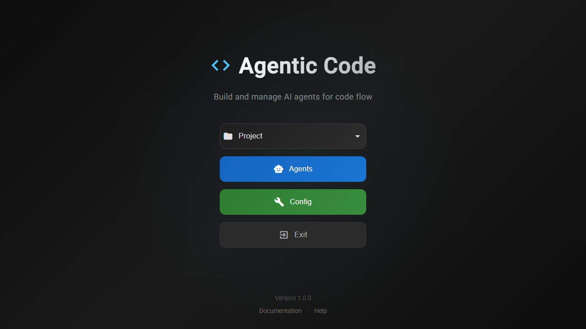

O menu oferece acesso a todas as funcionalidades:
- **Novo Projeto** - Criar um novo projeto
- **Abrir Projeto** - Abrir projetos existentes
- **Agentes** - Gerenciar agentes
- **Scripts** - Gerenciar scripts
- **Skills** - Gerenciar skills
- **Commands** - Gerenciar comandos
- **Templates** - Gerenciar templates
- **Configurações** - Configurações do sistema
- **Exportar** - Exportar dados
- **Importar** - Importar dados
- **Backup** - Fazer backup

---

## Gerenciamento de Projetos

### Criando um Novo Projeto

1. Clique em **Novo Projeto** no menu
2. Preencha os dados:

**Nota:** O diálogo "Novo Projeto" abre ao clicar no botão "Novo Projeto" na tela principal.

| Campo | Descrição |
|-------|----------|
| Nome | Nome do projeto (obrigatório) |
| Caminho | Diretório onde o projeto será criado |
| Namespace | Namespace para organizar recursos |

3. Clique em **Criar**

### Abrindo um Projeto Existente

1. Clique em **Abrir Projeto**
2. Selecione na lista de projetos recentes ou navegue até o diretório

**Nota:** O diálogo "Abrir Projeto" abre ao clicar no botão "Abrir Projeto" na tela principal.

### Estrutura de um Projeto

```
meu-projeto/
├── .agentic/
│   ├── pipelines/
│   │   └── meu-pipeline/
│   │       └── 2024-01-15_143022/
│   │           ├── step1-result.txt
│   │           └── step2-result.txt
│   └── db/
│       └── project.db
└── arquivos-do-projeto/
```

---

## Criando Pipelines

Um pipeline é uma sequência de etapas que serão executadas em ordem. Cada etapa pode ser um agente ou um script.

### Adicionando Steps ao Pipeline

1. Abra um projeto
2.Clique no botão **+** para adicionar um step

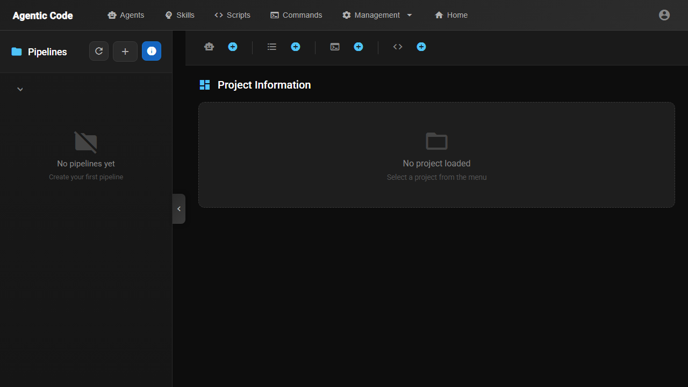

### Tipos de Steps

#### Step de Agente

Executa um agente de IA (OpenCode, Copilot, etc.)

**Nota:** O diálogo de configuração de step de agente abre ao clicar em "+" e selecionar "Agente".

| Campo | Descrição |
|-------|----------|
| Agente | Selecione o agente a usar |
| Prompt | Instrução para o agente |
| Input | Dados de entrada (opcional) |
| Output | Como tratar a saída |

**Placeholders disponíveis:**
- `{{previous-output-file}}` - Saída do step anterior
- `{{file:caminho}}` - Conteúdo de um arquivo
- `{{env:variavel}}` - Variável de ambiente
- `{{step:N:output}}` - Saída do step N

#### Step de Script

Executa um script (Node.js, Python, etc.)

**Nota:** O diálogo de configuração de step de script abre ao clicar em "+" e selecionar "Script".

| Campo | Descrição |
|-------|----------|
| Script | Selecione o script |
| Runtime | cmd, node, java, py, custom |
| Parâmetros | Argumentos adicionais |

### Configurações do Pipeline

Clique com botão direito no pipeline para configurar:

**Nota:** As configurações do pipeline estão disponíveis no menu de contexto (botão direito).

| Opção | Descrição |
|-------|----------|
| Tipo | Sequencial ou Step-by-Step |
| Pausar ao Falhar | Pausa execução se um step falhar |
| Timeout | Tempo máximo por step |

### Salvando o Pipeline

1. Dê um nome ao pipeline no campo correspondente
2. Clique em **Salvar**

---

## Executando Pipelines

### Modo Sequencial

Executa todos os steps em sequência automáticamente.

1. Vá para a tela **Run Pipelines**
2. Selecione o pipeline
3. Clique em **Run**

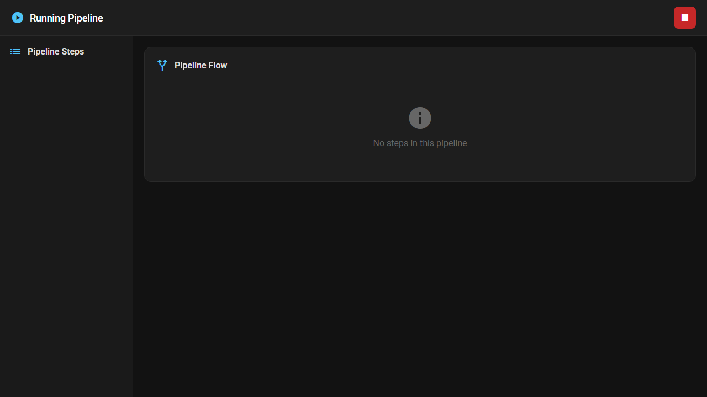

### Modo Step-by-Step

Execute cada step separadamente e revise antes de continuar.

1. Selecione o pipeline
2. Clique em **Run Step-by-Step**
3. Para cada step:
   - Revise o prompt/input
   - Clique em **Run Step** para executar
   - Revise a saída
   - Clique em **Next Step** ou **Stop**

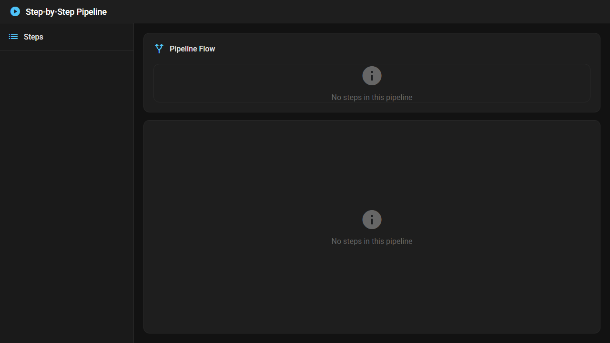

### Monitorando Execução

A saída é exibida em tempo real na tela de execução do pipeline.

**Cores de status:**
- 🟡 Amarelo: Executando
- 🟢 Verde: Concluído com sucesso
- 🔴 Vermelho: Falhou

### Histórico de Execução

Veja execuções anteriores em **Pipeline Run History**:

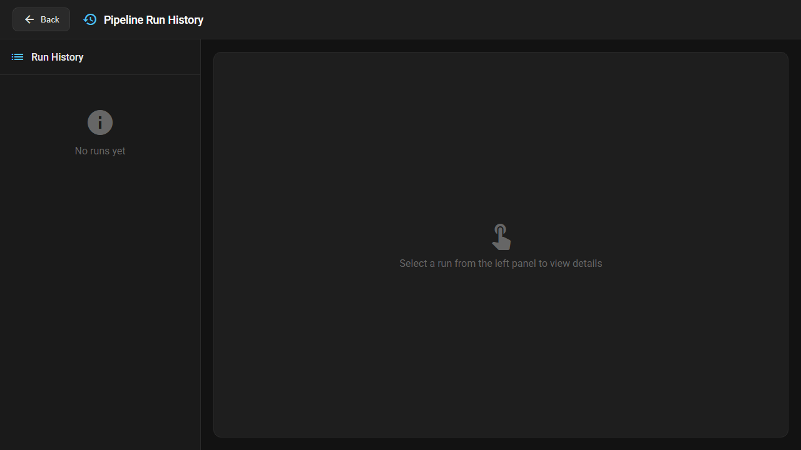

---

## Gerenciamento de Agentes

Gerencie seus agentes de IA em **Agentes**:

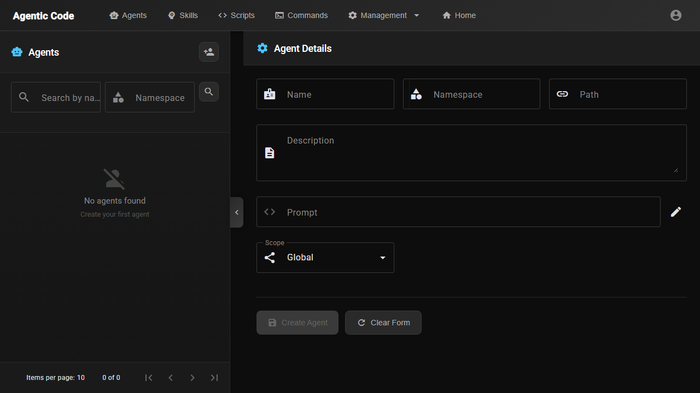

### Criando um Agente

1. Clique em **+ Novo Agent**
2. Preencha:

| Campo | Descrição |
|-------|----------|
| Nome | Nome do agente |
| CLI | opencode, copilot, custom |
| Prompt Template | Template do prompt |

**Exemplo de Prompt Template:**
```
Você é um assistente de programação.
{{task}}

Contexto do projeto:
{{context}}

Arquivos relevantes:
{{files}}
```

### Fields de Prompt

| Field | Descrição |
|-------|----------|
| {{task}} | Tarefa atual |
| {{context}} | Contexto do projeto |
| {{files}} | Arquivos selecionados |
| {{previous-output}} | Saída do step anterior |

---

## Scripts e Comandos

### Scripts

Crie scripts reutilizáveis em **Scripts**:

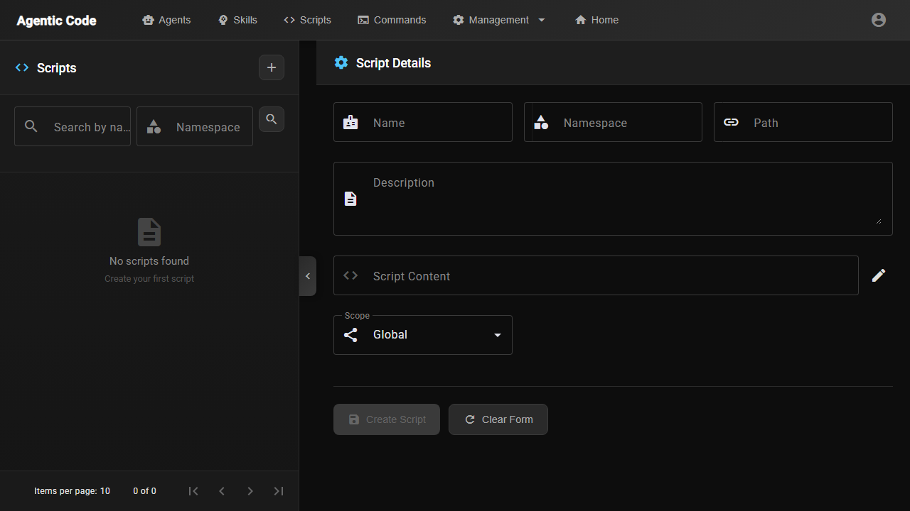

#### Criando um Script

1. Clique em **+ Novo Script**
2. Preencha:

| Campo | Descrição |
|-------|----------|
| Nome | Nome do script |
| Descrição | Descrição breve |
| Conteúdo | Código do script |

**Exemplo (Node.js):**
```javascript
const fs = require('fs');
const input = process.argv[2];
const files = fs.readdirSync(input);
files.forEach(f => console.log(f));
```

#### Variáveis de Input

Use no conteúdo do script:
- `$INPUT` - Input do step
- `$PREVIOUS_OUTPUT` - Output do step anterior
- `$ARGUMENTS` -Argumentos passados

### Commands

Comandos são scripts simples que executam ações diretas:

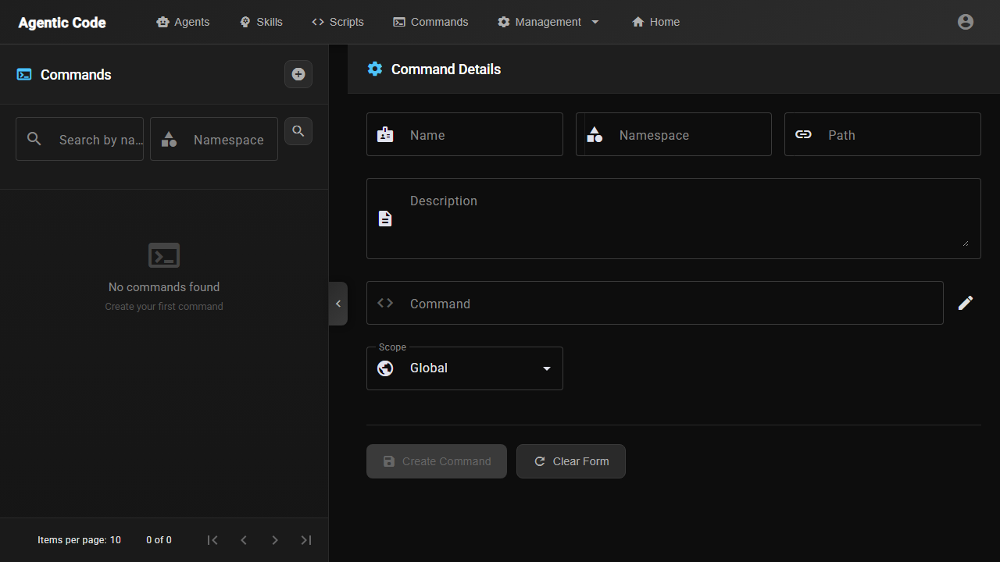

| Comando | Descrição |
|---------|----------|
| `git status` | Status do git |
| `npm test` | Executar testes |
| `npm run build` | Build do projeto |

---

## Skills

Skills são conjuntos de arquivos e ferramentas que um agente pode usar:

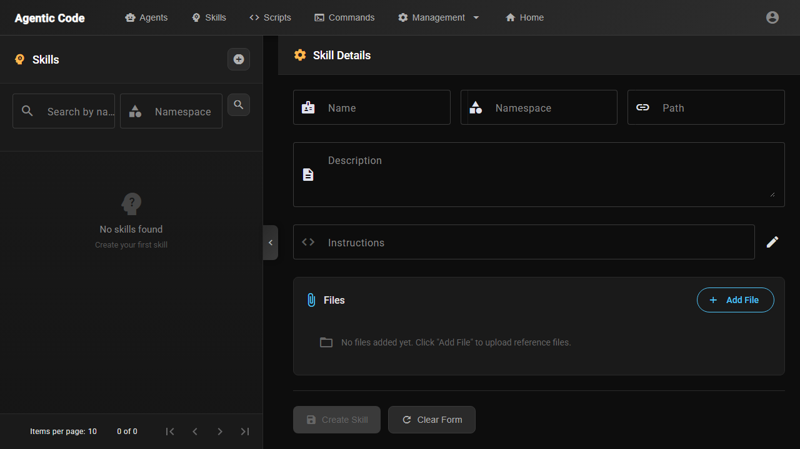

### Criando uma Skill

1. Clique em **+ Nova Skill**
2. Preencha o nome e descrição
3. Adicione arquivos
4. Configure tools disponíveis

---

## Templates

Templates são promptos pré-configurados reutilizáveis:

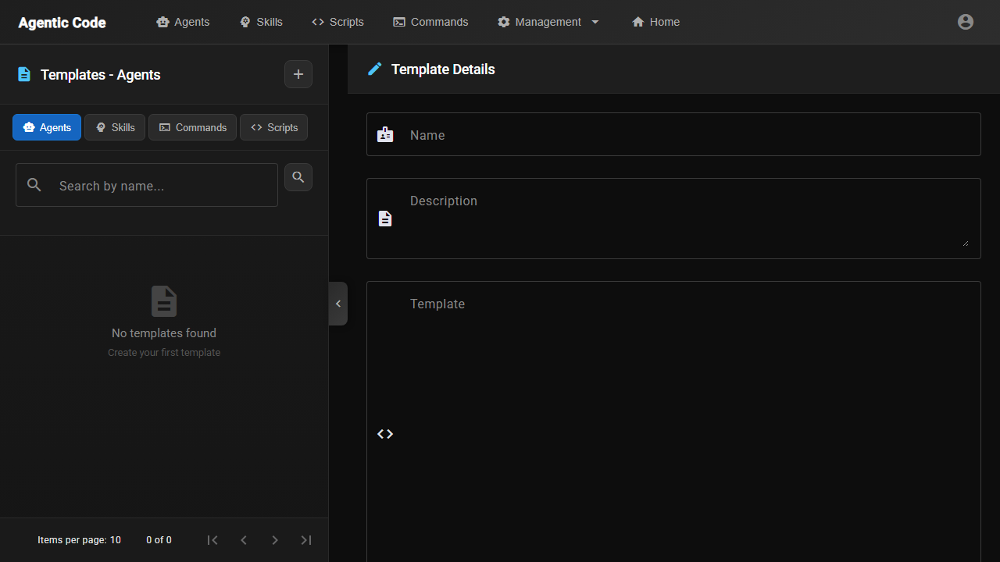

### Criando um Template

1. Clique em **+ Novo Template**
2. Preencha:

| Campo | Descrição |
|-------|----------|
| Nome | Nome do template |
| Descrição | Descrição breve |
| Prompt | Conteúdo do template |

**Exemplo:**
```
Reveja o seguinte código e proponha melhorias:

{{code}}

Considere:
- Performance
- Legibilidade
- Boas práticas
```

---

## Configurações

Configure o sistema em **Configurações**:

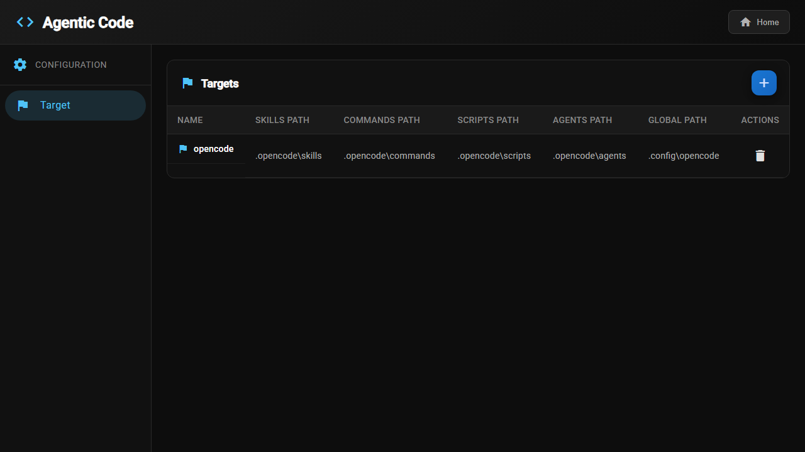

| Opção | Descrição |
|-------|----------|
| CLIT padrão | opencode ou copilot |
| Timeout | Tempo limite por step |
| Auto-save | Salvar automaticamente |

---

## Histórico de Execução

Acesse em **Pipeline Run History**:


Para cada execução você pode ver:
- Data e hora
- Status (sucesso/falha)
- Saída de cada step
- Tempo de execução

Clique em **View** para ver os detalhes.

---

## Resolução de Problemas

### Problema: Pipeline não executa

**Causas possíveis:**
1. Backend não está rodando → Reinicie com `mvn spring-boot:run`
2. Agente não encontrado → Verifique a configuração do step

### Problema: Step falha

1. Verifique a saída no log
2. Ajuste o prompt/input
3. No modo step-by-step, execute novamente

### Problema: Timeout

Aumente o timeout em configurações do pipeline ou do step.

### Problema: Arquivo tools não encontrado

Certifique-se que `~/.agentic/tools` existe. O sistema cria automaticamente ao iniciar.

---

## Referência Rápida

### Atalhos de Teclado

| Atalho | Ação |
|--------|------|
| Ctrl+S | Salvar |
| Ctrl+N | Novo |
| Ctrl+O | Abrir |
| F5 | Run |

### Variáveis de Ambiente

| Variável | Descrição |
|----------|----------|
| OPENCODE_HOME | Diretório do usuário |
| PATH | Inclui ~/.agentic/tools |

### Recursos Adicionais

- GitHub: https://github.com/seu-repo/ai-suite
- Documentação técnica: `docs/tecnica.md`